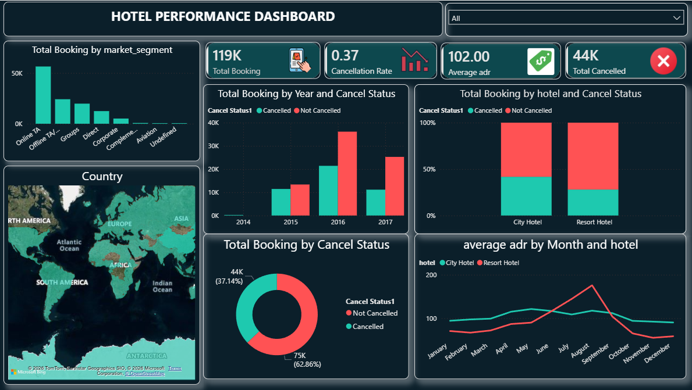

# 🏨 Hotel Performance Dashboard (Power BI)

## 📊 Overview
This project is a Power BI dashboard analyzing hotel booking data, focusing on booking trends, cancellation rates, and pricing insights.

## 🔥 Key Insights
- City hotels have higher cancellation rates
- Higher ADR (price) leads to more cancellations
- Peak bookings occur during mid-year months

## 📁 Files Included
- hotel_dashboard.pbix (Power BI file)
- dashboard.png (Dashboard preview)

## 🛠 Tools Used
- Power BI
- DAX
- Data Visualization

## 📸 Dashboard Preview

